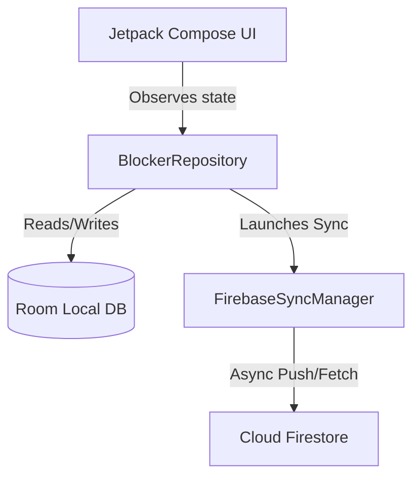

# Reels Blocker — Block Reels, Shorts

[](https://android.com)
[](https://kotlinlang.org)
[](https://developer.android.com/topic/libraries/architecture)
[](https://developer.android.com/training/data-storage/room)
[](https://firebase.google.com/docs/firestore)

Reels Blocker stops short-form video content from Facebook Reels, Instagram Reels, YouTube Shorts, and Snapchat Spotlights — all controlled from one simple place.

---

## ✨ Features

- **🎯 Smart App & Keyword Matching**: Uses a high-performance, low-latency tree traversal algorithm to detect Reels, Shorts, and Spotlight views instantly without sluggishness.
- **📱 Multi-Platform Support**: Granular, per-platform toggle options for:
  - **Instagram**: Reels tab, suggested reels, clips, and reel viewers.
  - **YouTube**: Shorts players, shorts tab, and video shelf elements.
  - **Facebook**: Reels tab, watch reels, and suggested short-form videos.
  - **Snapchat**: Spotlight view and spotlight video players.
- **🕒 Smart Scheduler (With Overnight Support)**: Set active hours where the blocker is enforced (e.g., bedtime block from `22:00` to `06:00` or work block).
- **📊 Real-time Stats & Analytics**: Local logging of block events persisted in a secure Room database. View charts and details of which platforms you spend too much time on.
- **🔄 Cloud Sync & Backup**: Seamlessly syncs local settings and block metrics to Cloud Firestore in real-time, allowing you to back up your progress and view consistent statistics across all logged-in devices.
- **⚡ Battery & Performance Optimized**: Employs structural event throttling (250ms interval validation) ensuring negligible impact on battery life and smooth operation.
- **🔒 Privacy First**: Core blocking is 100% offline. Authentication is handled securely via Firebase, and no browsing or keyword matches are sent to the cloud.

---

## 🛠️ Tech Stack & Architecture

- **Core Language**: [Kotlin](https://kotlinlang.org/)
- **UI Framework**: [Jetpack Compose](https://developer.android.com/jetpack/compose) for a beautiful, modern, fluid design
- **Architecture**: MVVM (Model-View-ViewModel) pattern with Repository layer
- **Local Database**: [Room SQLite](https://developer.android.com/training/data-storage/room) for persistent, localized storage of block events and configurations
- **Cloud Sync Backend**: [Firebase Firestore](https://firebase.google.com/docs/firestore) for secure real-time cloud sync and backup
- **Authentication**: [Firebase Authentication](https://firebase.google.com/docs/auth) for user login, authentication, and secure document access
- **Service Integration**: Android Accessibility Service API (`AccessibilityService`)
- **Coroutines & Flows**: Modern reactive streams for asynchronous settings management and stats tracking

---

## 🔄 Cloud Synchronization & Data Architecture

Reels Blocker uses a hybrid repository architecture to synchronize state across devices. Data is managed by [BlockerRepository](file:///d:/github/reels-blocker/app/src/main/java/com/example/data/repository/BlockerRepository.kt) which acts as the coordinator between local and remote storage:



### 1. Data Schema
Cloud data is stored per-user in Firebase Firestore using the user's unique authentication ID (`uid`):
- **User Settings**: Saved in a single document `users/{uid}/settings/user_settings`. Syncs preferences like active toggles, scheduler timings, and aggregate stats (e.g., total blocked counts and total estimated time saved).
- **Block Logs**: Saved in `users/{uid}/block_events/{timestamp}`. Each block event creates a record containing the targeted app/platform and details of the block.

### 2. Synchronization Strategy
- **Local-First Writes**: When a block occurs, the event is immediately recorded in the local Room database and UI stats update instantly.
- **Background Cloud Sync**: The app schedules a background coroutine via [FirebaseSyncManager](file:///d:/github/reels-blocker/app/src/main/java/com/example/data/remote/FirebaseSyncManager.kt) to upload the new `BlockEvent` and update the aggregated `UserSettings` in Firestore.
- **Login Merging**: When a user logs in, [BlockerRepository](file:///d:/github/reels-blocker/app/src/main/java/com/example/data/repository/BlockerRepository.kt):
  1. Pulls cloud settings and merges them into the local Room database.
  2. Pulls all historical block events from Firestore and inserts them into Room, rebuilding [StatsScreen](file:///d:/github/reels-blocker/app/src/main/java/com/example/ui/screens/StatsScreen.kt)'s charts and trends.
- **Security Rules**: Access control is defined in [firestore.rules](file:///d:/github/reels-blocker/firestore.rules) to ensure authenticated users can only read or write their own documents:
  ```javascript
  match /users/{userId}/{document=**} {
    allow read, write: if request.auth != null && request.auth.uid == userId;
  }
  ```

---

## 📂 Directory Structure

```text
reels-blocker/
├── app/
│   ├── src/main/
│   │   ├── java/com/example/
│   │   │   ├── data/                 # Data Layer
│   │   │   │   ├── local/            # Local SQLite Room database and DAOs
│   │   │   │   ├── model/            # Data models (UserSettings, BlockEvent)
│   │   │   │   ├── remote/           # Firebase sync logic (FirebaseSyncManager)
│   │   │   │   └── repository/       # Repository coordinating Room & Firestore
│   │   │   ├── ui/                   # Jetpack Compose UI (Screens, ViewModel)
│   │   │   │   ├── screens/          # StatsScreen, PlatformsScreen, HomeScreen, Onboarding
│   │   │   ├── MainActivity.kt       # Application Entry point
│   │   │   ├── OverlayBlockerActivity.kt # Custom Blocking Overlay
│   │   │   └── ReelsBlockerAccessibilityService.kt # Core Accessibility Daemon
│   │   └── res/                      # Resource layouts, XMLs, and drawables
│   └── build.gradle.kts              # Module-level Gradle configuration
├── firebase.json                     # Firebase emulator and deployment configuration
├── firestore.rules                   # Security rules enforcing per-user data access
└── build.gradle.kts                  # Project-level Gradle configuration
```

---

## 🚀 Setup & Run Locally

### Prerequisites

- [Android Studio Jellyfish+](https://developer.android.com/studio)
- Android device or Emulator running **Android 8.0 (API level 26) or higher**
- A [Firebase Project](https://console.firebase.google.com/) with Cloud Firestore and Authentication enabled

### Installation Steps

1. **Clone & Open**:
   Open Android Studio, select **Open**, and navigate to the root directory of this project.

2. **Add Firebase Configuration**:
   - Register your Android app package name (e.g. `com.sahed.reels_blocker`) in the Firebase console.
   - Download the `google-services.json` file and place it in the `app/` directory of the project.
   - Enable **Google Sign-In** under Authentication and start **Cloud Firestore** in your Firebase console.

3. **Configure Local Properties**:
   Ensure `local.properties` correctly points to your Android SDK path.

4. **Signing Configuration (Debug / Release Run)**:
   By default, the release build type in `app/build.gradle.kts` is configured to sign with a release configuration. If you run a debug build, Gradle uses the standard debug key automatically.

5. **Deploy**:
   Connect your physical device or boot up an emulator and click **Run** (`Shift + F10` or the play button in the toolbar).

---

## ⚙️ Enabling the Accessibility Service

To activate the Reels Blocker on your Android device:

1. **(Android 13+ only)**: If the accessibility setting is restricted, first go to **Settings** > **Apps** > **Reels Blocker**. Tap the 3-dot menu in the top right and select **Allow restricted settings**.
2. Navigate to **Settings** > **Accessibility**.
3. Locate **Reels Blocker** under downloaded/installed services.
4. Toggle **Use Reels Blocker** to **ON**.
5. Confirm the system dialog permission warning (required to analyze active application node structures).

---

## 🤝 Contributing

Contributions are extremely welcome! If you have suggestions for new keyword match terms, optimizations to the accessibility node matching algorithm, or additional feature requests, please open an Issue or submit a Pull Request.

## 📄 License

This project is licensed under the Apache License 2.0. See the LICENSE file for details.
